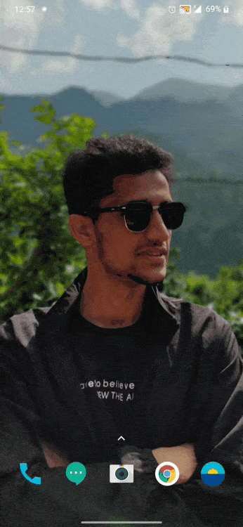
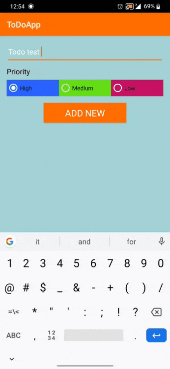

# ToDoFinal
TodoApp is an android app that allows user to add their daily normal tasks. Allow them to priotize, modify and delete dask details.

&nbsp;

&nbsp;

&nbsp;

<h1>Features of This ToDoApp</h1>

Add, Modify and remove todo items.
Can tap to a todo item to navigate to detailed view and swipe left or right to change.
Can priotize todo items.

<h1> Framework Used</h1>

Model–view–viewmodel (MVVM) is a software architectural pattern. MVVM facilitates a separation of development of the graphical user interface – be it via a markup language or GUI code – from development of the business logic or back-end logic (the data model). Used Components

MVVM framework Fragments Adapters View Pagers

Prerequisties

Android Studio (IDE)

Libraries Used LiveData ViewModel Room

<h1>License</h1>

Copyright 2019 Shankar Sapkota Student The British College.
